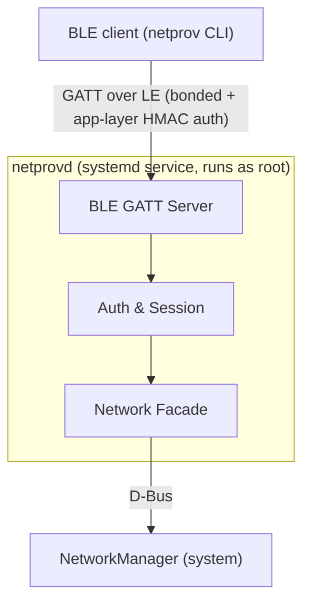

# netprov

BLE-provisioned network configuration for headless embedded Linux. A systemd
service (`netprovd`) advertises a GATT service that a paired client can use to
list interfaces, read IP configuration, scan Wi-Fi, and set DHCP / static IPv4
/ Wi-Fi credentials. Written in Rust, talks to NetworkManager over D-Bus.

The companion `netprov` CLI speaks the same protocol over TCP (loopback, for
dev) or BLE (for production).

## Architecture



Three Rust crates in one workspace:

| Crate | Role |
|---|---|
| `netprov-protocol` | Wire format: CBOR messages, framing, HMAC auth helpers. Transport-agnostic. |
| `netprov-server` | `netprovd` daemon. BLE GATT driver, session state machine, `NetworkFacade` (mock + nmrs). |
| `netprov-client` | `netprov` CLI. Connects over BLE (via `--ble-peer`) or TCP behind the `dev-tcp` feature. |

## Install (from deb)

Builds for `amd64` and `aarch64` are produced by CI as artifacts. On a target
box:

```bash
sudo dpkg -i netprov_0.1.0-1_arm64.deb
sudo netprovd keygen --install        # generate and install a production PSK
sudo systemctl enable --now netprovd  # start at boot + now
```

The deb does not auto-start — the admin must install a production key first.
Running with the embedded dev key (the committed PSK under `packaging/`) logs
a loud warning every 60 seconds.

`NETPROV_PRODUCTION=1` in the unit's environment disables the dev-key
fallback; the service refuses to start without a real key at
`/etc/netprov/key`.

## Dev quickstart (no BLE, no NetworkManager)

The full request/response surface is exercised end-to-end over TCP against an
in-memory `MockFacade`:

```bash
# one terminal
cp packaging/dev-key.bin /tmp/netprov-key.bin && chmod 600 /tmp/netprov-key.bin
cargo run -p netprov-server --bin netprovd -- serve-tcp --listen 127.0.0.1:9600

# another terminal
cargo run -p netprov-client --features dev-tcp --bin netprov -- \
  --key-path /tmp/netprov-key.bin --endpoint 127.0.0.1:9600 list
```

`list`, `ip <iface>`, `wifi-status`, `wifi-scan`, `wifi-connect`, `set-dhcp`,
`set-static` all work against the mock.

## BLE smoke test

See [`packaging/SMOKE-TEST.md`](packaging/SMOKE-TEST.md) for the two-box
hardware-in-the-loop runbook.

## Build matrix

```bash
cargo test --workspace                                 # default: no BLE, no NM
cargo build -p netprov-server --features live-ble      # + BLE GATT server
cargo build -p netprov-server --features live-nm       # + real NetworkManager
cargo deb -p netprov-server                            # build the .deb
```

`live-ble` implies `live-nm` (production BLE needs NM). `live-nm-destructive`
gates the mutating `NmrsFacade` integration tests that are unsafe to run in
CI.

## Desktop app dev setup

The Dioxus desktop app is gated behind the `desktop` feature because it needs
native GTK/WebKit development libraries on Linux. On Ubuntu/Debian:

```bash
sudo apt-get install -y \
  pkg-config \
  libgtk-3-dev \
  libwebkit2gtk-4.1-dev \
  libayatana-appindicator3-dev \
  libxdo-dev
```

Then run the BLE-first desktop app with:

```bash
cargo run -p netprov-app --features desktop
```

The app talks to target devices over BLE; the TCP transport remains a dev/test
path for protocol regression coverage.

## Testing tiers

| Tier | In CI? | Covers |
|---|---|---|
| Unit tests | Yes | Protocol: CBOR round-trips, framing, HMAC, bounded strings. Plus proptests. |
| Session-layer | Yes | `Session` state machine against `MockFacade`. |
| Client↔server loopback | Yes | Full request/response surface via `tokio::io::duplex`. |
| Live NetworkManager | Opt-in | `--features live-nm -- --ignored`. Requires NM on the system bus. |
| Live BLE e2e | Opt-in | `--features live-ble` + two BLE-equipped boxes. |

## Spec and plans

- [Design spec](docs/superpowers/specs/2026-04-23-netprov-design.md)
- [Part 1 plan](docs/superpowers/plans/2026-04-23-netprov-part-1-core.md) — protocol, session, mock facade, loopback
- [Part 2 plan](docs/superpowers/plans/2026-04-23-netprov-part-2-ble-systemd-deb.md) — BLE GATT, systemd, NmrsFacade, cargo-deb, CI

## License

MIT OR Apache-2.0.
