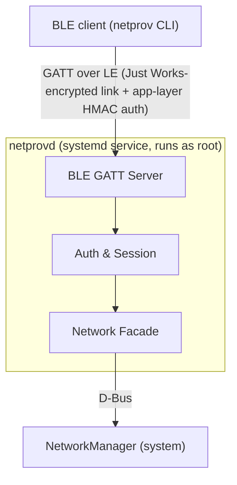

# netprov

BLE-provisioned network configuration for headless embedded Linux. A systemd
service (`netprovd`) advertises a GATT service that a paired client can use to
list interfaces, read IP configuration, scan Wi-Fi, and set DHCP / static IPv4
/ Wi-Fi credentials. Written in Rust, talks to NetworkManager over D-Bus.

The companion `netprov` CLI speaks the same protocol over TCP (loopback, for
dev) or BLE (for production).

## Architecture


```mermaid
flowchart TD
    Client["BLE client (netprov CLI)"]
    NM["NetworkManager (system)"]

    subgraph Daemon["netprovd (systemd service, runs as root)"]
        direction LR
        GATT["BLE GATT Server"]
        Session["Auth &amp; Session"]
        Facade["Network Facade"]
        GATT --> Session --> Facade
    end

    Client -->|"GATT over LE (Just Works-encrypted link + app-layer HMAC auth)"| GATT
    Facade -->|D-Bus| NM
```

**Security posture:** the sensitive characteristics (ChallengeNonce, AuthResponse,
Request/Response — everything but Info) require an encrypted link
(`encrypt_read`/`encrypt_write` in `crates/server/src/ble/gatt.rs`). Since
`netprovd` runs headless with no display or keyboard, it registers a
no-IO-capability `bluer::agent::Agent` (`crates/server/src/ble/server.rs`), so
BlueZ negotiates Just Works pairing on first access.

Note the flags are deliberately **not** the `encrypt_authenticated_*` variants.
Those are BlueZ's `BT_SECURITY_HIGH` and require an MITM-protected LTK, which
Just Works cannot produce — a headless peripheral has no way to display or
confirm a passkey, so with those flags set every read of a sensitive
characteristic fails with "Encryption is insufficient" no matter how the
pairing prompt is answered.

MITM protection therefore comes from the application layer, which is the only
layer holding a shared secret. The handshake is **mutual**: the server issues a
nonce, the client returns its own nonce plus `HMAC(PSK, "client" ‖ Ns ‖ Nc)`,
and the server — only after that verifies — answers with
`HMAC(PSK, "server" ‖ Ns ‖ Nc)`, which the client checks before sending
anything. The two tags are domain-separated so neither can be replayed as the
other. An active MITM that completes Just Works pairing can therefore neither
issue commands nor impersonate the device: it cannot produce the server tag, so
the client aborts before Wi-Fi credentials (`Op::ConnectWifi`) are ever sent.

The residual risk is confidentiality of the pre-auth exchange: an MITM present
*during* pairing can observe traffic up to the point authorization completes
(e.g. the ChallengeNonce, which is public by design). The Info characteristic
(model + protocol version only, per spec §11) stays unauthenticated and
unencrypted.

Five Rust crates in one workspace:

| Crate | Role |
|---|---|
| `netprov-protocol` | Wire format: CBOR messages, framing, HMAC auth helpers. Transport-agnostic. |
| `netprov-server` | `netprovd` daemon. BLE GATT driver, session state machine, `NetworkFacade` (mock + nmrs). |
| `netprov-sdk` | Transport-agnostic `ProvisioningClient` trait plus BLE/TCP transport implementations, shared by the CLI and desktop app. BLE runs on Linux, macOS and Windows. |
| `netprov-client` | `netprov` CLI. Connects over BLE (via `--ble-peer`) or TCP behind the `dev-tcp` feature. |
| `netprov-app` | Dioxus desktop UI, gated behind the `desktop` feature. |

## Install (from deb)

Builds for `amd64` and `aarch64` are produced by CI as artifacts. On a target
box:

```bash
sudo dpkg -i netprov_<version>_arm64.deb
sudo netprovd keygen --install        # generate and install a production PSK
sudo systemctl enable --now netprovd  # start at boot + now
```

The deb does not auto-start — the admin must install a production key first.
`packaging/netprovd.service` ships with `NETPROV_PRODUCTION=1` set, so the
daemon refuses to start without a real key at `/etc/netprov/key` rather than
silently falling back to the embedded dev key (the committed PSK under
`packaging/`, used only by `serve-tcp` for local dev/loopback tests, where it
logs a loud warning every 60 seconds).

## Dev quickstart (no BLE, no NetworkManager)

The full request/response surface is exercised end-to-end over TCP against an
in-memory `MockFacade`:

```bash
# one terminal
cp packaging/dev-key.bin /tmp/netprov-key.bin && chmod 600 /tmp/netprov-key.bin
cargo run -p netprov-server --bin netprovd -- serve-tcp --listen 127.0.0.1:9600

# another terminal
cargo run -p netprov-client --features dev-tcp --bin netprov -- \
  --key-path /tmp/netprov-key.bin --endpoint 127.0.0.1:9600 list
```

`list`, `ip <iface>`, `wifi-status`, `wifi-scan`, `wifi-connect`, `set-dhcp`,
`set-static` all work against the mock.

## BLE smoke test

See [`packaging/SMOKE-TEST.md`](packaging/SMOKE-TEST.md) for the two-box
hardware-in-the-loop runbook.

## BLE clients on macOS and Windows

`netprovd` is a GATT *peripheral* and stays Linux-only. The CLI and desktop
app are pure GATT *centrals*, so they run anywhere: `netprov-sdk`'s `ble`
feature selects `bluer` (BlueZ) on Linux and
[`btleplug`](https://github.com/deviceplug/btleplug) (CoreBluetooth on macOS,
WinRT on Windows) elsewhere. Nothing extra to enable — `--features ble` and
`--features desktop` just work off-Linux now.

One difference matters in practice: **macOS never tells applications a peer's
MAC address.** CoreBluetooth hands out an opaque per-host `CBPeripheral` UUID
instead, which is stable for that Mac and meaningless on any other. So
`--ble-peer` takes an opaque identifier rather than a BD_ADDR. Discover it
with the scan subcommand, which needs no PSK and no connection:

```bash
cargo run -p netprov-client --features ble --bin netprov -- ble-scan
# 6E4A1B0C-9E3F-4A21-B0D4-7C2F1A8E55D9   netprovd-a1b2   -57 dBm

cargo run -p netprov-client --features ble --bin netprov -- \
  --key-path ./netprov-key.bin \
  --ble-peer 6E4A1B0C-9E3F-4A21-B0D4-7C2F1A8E55D9 list
```

The advertised device name works as an identifier too (`--ble-peer
netprovd-a1b2`), which is usually easier to type. On Linux and Windows the
BD_ADDR still works as before.

Two more macOS notes:

- The first connection triggers a **system pairing prompt** — the Challenge,
  AuthResponse and Request characteristics all require an encrypted link.
  Accepting it is enough; the prompt has no passkey to compare, because Just
  Works is all a headless peripheral can offer. A terminal-launched CLI also
  needs Bluetooth permission granted to the terminal app itself
  (System Settings → Privacy & Security → Bluetooth).
- Prefer the identifier `ble-scan` prints over a remembered device name.
  CoreBluetooth replaces its cached name with the peer's GATT device name after
  the first connection (a Pi reports its hostname), so the advertised name is
  not what a later `system_profiler` or Bluetooth-settings listing will show.
  Both names resolve via `--ble-peer`, but the scan handle never changes.
- CoreBluetooth does not expose the negotiated ATT MTU, so the client
  fragments requests at the mandatory 20-byte floor. That is correct but
  chatty; set `NETPROV_BLE_MAX_FRAGMENT` to raise it if a peer is known to
  negotiate more.

## Build matrix

```bash
cargo test --workspace                                 # default: no BLE, no NM
cargo build -p netprov-server --features live-ble      # + BLE GATT server
cargo build -p netprov-server --features live-nm       # + real NetworkManager
cargo build -p netprov-client --features ble           # CLI + BLE (any OS)
cargo build -p netprov-client --features ble-btleplug  # force btleplug on Linux
cargo deb -p netprov-server                            # build the .deb
```

`live-ble` implies `live-nm` (production BLE needs NM). `live-nm-destructive`
gates the mutating `NmrsFacade` integration tests that are unsafe to run in
CI. `ble-btleplug` forces the portable backend on Linux so the macOS code path
stays covered by Linux CI and local builds.

## Desktop app dev setup

The Dioxus desktop app is gated behind the `desktop` feature because it needs
native GTK/WebKit development libraries on Linux. macOS needs no extra
packages — WebKit and CoreBluetooth are part of the OS. On Ubuntu/Debian:

```bash
sudo apt-get install -y \
  pkg-config \
  libgtk-3-dev \
  libwebkit2gtk-4.1-dev \
  libayatana-appindicator3-dev \
  libxdo-dev
```

Then run the BLE-first desktop app with:

```bash
cargo run -p netprov-app --features desktop
```

The app talks to target devices over BLE; the TCP transport remains a dev/test
path for protocol regression coverage.

## Testing tiers

| Tier | In CI? | Covers |
|---|---|---|
| Unit tests | Yes | Protocol: CBOR round-trips, framing, HMAC, bounded strings. Plus proptests. |
| Session-layer | Yes | `Session` state machine against `MockFacade`. |
| Client↔server loopback | Yes | Full request/response surface via `tokio::io::duplex`. |
| Live NetworkManager | Opt-in | `--features live-nm -- --ignored`. Requires NM on the system bus. |
| Live BLE e2e | Opt-in | `--features live-ble` + two BLE-equipped boxes. |

## Spec and plans

- [Design spec](docs/superpowers/specs/2026-04-23-netprov-design.md)
- [Part 1 plan](docs/superpowers/plans/2026-04-23-netprov-part-1-core.md) — protocol, session, mock facade, loopback
- [Part 2 plan](docs/superpowers/plans/2026-04-23-netprov-part-2-ble-systemd-deb.md) — BLE GATT, systemd, NmrsFacade, cargo-deb, CI

## License

MIT OR Apache-2.0.
