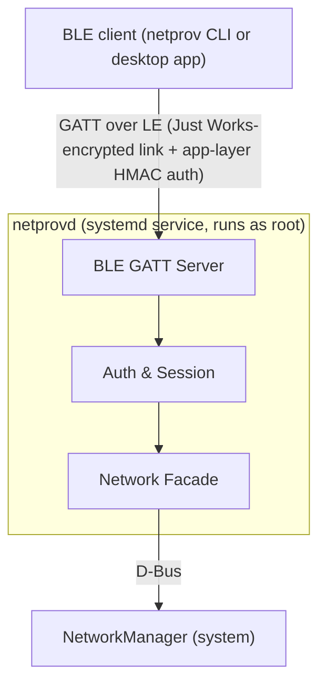

# Architecture and Security

## Security posture

The sensitive characteristics—ChallengeNonce, AuthResponse, Request, and
Response—require an encrypted link through `encrypt_read` and `encrypt_write`
in `crates/server/src/ble/gatt.rs`. The Info characteristic, which contains only
the model and protocol version, stays unauthenticated and unencrypted.

`netprovd` also exposes the standard Bluetooth SIG Current Time Service
(0x1805), so an already-connected client can give a clockless device a
trustworthy wall clock. Reading the Current Time characteristic (0x2A2B) is
unauthenticated, like Info — it only discloses the server's own clock. Writing
it requires an *authenticated* session, checked the same way `on_request`
checks one: link-layer encryption (`encrypt_write`) is necessary but not
sufficient, since a wrong write here can silently expire or revive
certificates elsewhere in the system.

Because `netprovd` runs headless, it registers a no-input/no-output BlueZ agent.
BlueZ therefore uses Just Works pairing. The characteristics deliberately do
not use `encrypt_authenticated_*`: those flags require an MITM-protected LTK,
which a headless peripheral cannot produce.

MITM protection comes from the application layer, where both sides hold a
pre-shared key. The server issues a nonce, and the client returns its own nonce
plus `HMAC(PSK, "client" || Ns || Nc)`. After verifying it, the server returns
`HMAC(PSK, "server" || Ns || Nc)`. The client verifies that tag before sending
any request, including Wi-Fi credentials. Domain separation prevents either
tag from being replayed as the other.

An active MITM can observe the pre-authentication exchange during Just Works
pairing, including the public challenge nonce, but cannot issue commands or
impersonate a device without the PSK.
